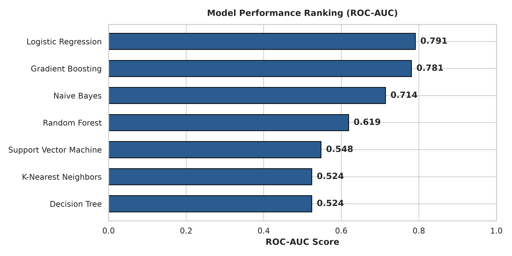
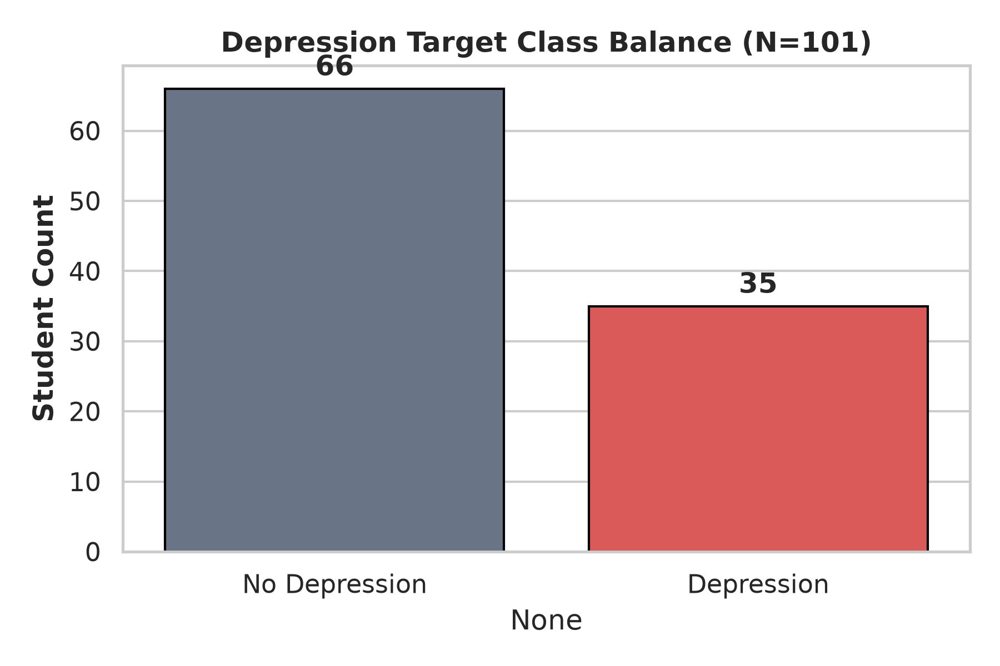

# 🎓 Student Mental Health Prediction using Supervised ML

## 📌 Executive Summary
This machine learning project evaluates supervised learning algorithms to predict student depression status based on academic, demographic, and behavioral factors.

---

## 🏆 Model Performance Summary

| Rank | Model | Accuracy | ROC-AUC |
| :--- | :--- | :--- | :--- |
| **1** | **Logistic Regression** | **85.7%** | **0.786** |
| 2 | Naive Bayes | 81.0% | 0.714 |
| 3 | Gradient Boosting | 76.2% | 0.690 |
| 4 | Random Forest | 76.2% | 0.619 |
| 5 | Support Vector Machine | 61.9% | 0.548 |
| 6 | K-Nearest Neighbors | 66.7% | 0.524 |
| 7 | Decision Tree | 61.9% | 0.524 |

---

## 📊 Visualizations

